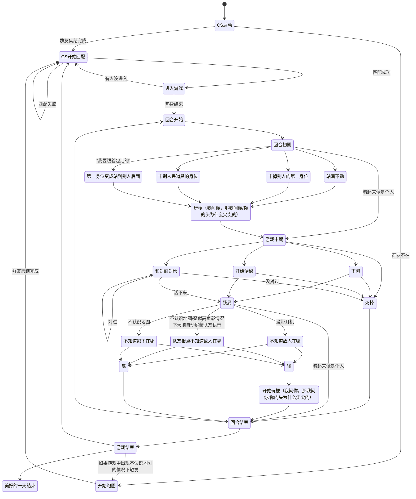

```mermaid
stateDiagram-v2
    [*] --> CS启动
    CS启动 --> CS开始匹配: 群友集结完成
    CS启动 --> 开始跑图: 群友不在
    开始跑图 --> CS开始匹配: 群友集结完成
    CS开始匹配 --> 进入游戏: 匹配成功
    CS开始匹配 --> CS开始匹配: 匹配失败
    进入游戏 --> 回合开始: 热身结束
    进入游戏 --> CS开始匹配: 有人没进入
    回合开始 --> 回合初期
    回合初期 --> 站着不动
    回合初期 --> 卡掉别人的第一身位
    回合初期 --> 卡别人丢道具的身位
    回合初期 --> 第一身位变成站到别人后面:“我要跟着包走的”
    回合初期 --> 游戏中期: 看起来像是个人
    站着不动 --> 玩梗（我问你，那我问你/你的头为什么尖尖的）
    卡掉别人的第一身位 --> 玩梗（我问你，那我问你/你的头为什么尖尖的）
    卡别人丢道具的身位 --> 玩梗（我问你，那我问你/你的头为什么尖尖的）
    第一身位变成站到别人后面 --> 玩梗（我问你，那我问你/你的头为什么尖尖的）
    玩梗（我问你，那我问你/你的头为什么尖尖的） --> 游戏中期
    游戏中期 --> 死掉
    死掉 --> 回合结束
    游戏中期 --> 开始便秘
    游戏中期 --> 和对面对枪
    游戏中期 --> 下包
    下包 --> 残局
    下包 --> 死掉
    开始便秘 --> 死掉
    开始便秘 --> 残局
    和对面对枪 --> 死掉: 没对过
    和对面对枪 --> 残局: 活下来
    和对面对枪 --> 和对面对枪: 对过
    残局 --> 不知道敌人在哪: 没带耳机
    残局 --> 队友报点不知道敌人在哪: 不认识地图/疑似高负载情况下大脑自动屏蔽队友语音
    残局 --> 不知道包下在哪: 不认识地图
    残局 --> 回合结束: 看起来像是个人
    不知道敌人在哪 --> 输
    队友报点不知道敌人在哪 --> 输
    不知道包下在哪 --> 输
    输 --> 开始玩梗（我问你，那我问你/你的头为什么尖尖的）
    不知道敌人在哪 --> 赢
    队友报点不知道敌人在哪 --> 赢
    不知道包下在哪 --> 赢
    开始玩梗（我问你，那我问你/你的头为什么尖尖的） --> 回合结束
    赢 --> 回合结束
    回合结束 --> 回合开始
    回合结束 --> 游戏结束
    游戏结束 --> 开始跑图: 如果游戏中出现不认识地图的情况下触发
    游戏结束 --> CS开始匹配
    游戏结束 --> 美好的一天结束
    
    
    
    
    
```

